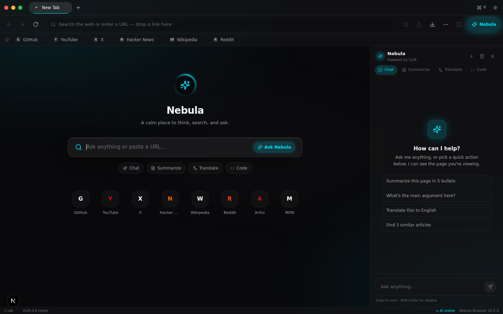

# Nebula Browser

A minimalistic, liquid-glass desktop browser with built-in GLM AI. Built with Next.js, Electron, TypeScript, Tailwind CSS, and Framer Motion.



## Features

### Core browsing
- **Real web browsing** — Electron `<webview>` loads actual websites (YouTube, Netflix, Google, Roblox — all work)
- **Background tabs stay alive** — audio keeps playing, video doesn't pause, scroll state preserved when switching tabs
- **Tab management** — drag to reorder, right-click for full context menu (duplicate, close others, close left/right, close all)
- **Split view** — pin a tab to the right half, drag the divider to resize, swap sides
- **Omnibox** — smart URL/search detection, drop URLs onto it
- **Bookmarks** — add/remove/reorder, persists across sessions
- **History** — searchable, grouped by day
- **Downloads** — auto-detected from webviews, live progress bar, open/save from panel

### AI assistant (Nebula AI)
- **Powered by GLM-4.6** with automatic fallback to Pollinations.ai (free, no auth)
- **No API keys needed** — works out of the box
- **4 modes**: Chat, Summarize, Translate, Code
- **Page context aware** — knows what you're viewing, can summarize it
- **Streaming responses** — token-by-token with markdown rendering
- **File attachment** — drop text/code files onto the AI sidebar to include their content
- **Multi-conversation** — switch between chats, auto-titled

### Design
- **Liquid glass UI** — backdrop-blur surfaces with inner highlights and ambient shadows
- **Neon accents** — 5 selectable colors (cyan, magenta, lime, amber, mono)
- **macOS / iOS 26 aesthetic** — traffic lights, spring physics, glass overlays
- **Smooth animations** — Framer Motion throughout, respects `prefers-reduced-motion`
- **Dark / Light / System theme**
- **3 glass intensity levels** (off / subtle / strong)

### Desktop integration
- **Custom title bar** — frameless window with draggable chrome bar
- **Functional traffic lights** (Windows/Linux) — close/minimize/maximize
- **Native right-click context menus** on web pages — copy image, save as, open link, etc.
- **File drag-and-drop** — drop OS files to open in a tab, or onto AI sidebar to attach
- **First-open onboarding tutorial** — 10-step guided tour

### Keyboard shortcuts
| Shortcut | Action |
|---|---|
| `⌘T` / `Ctrl+T` | New tab |
| `⌘W` / `Ctrl+W` | Close tab |
| `⌘L` / `Ctrl+L` | Focus omnibox |
| `⌘K` / `Ctrl+K` | Command palette |
| `⌘J` / `Ctrl+J` | Toggle AI sidebar |
| `⌘Y` / `Ctrl+Y` | History panel |
| `⌘,` / `Ctrl+,` | Settings |
| `⌘\` / `Ctrl+\` | Toggle split view |
| `⌘⇧\` / `Ctrl+Shift+\` | Swap split sides |
| `⌘1-9` | Switch to tab N |

## Quick start

### Prerequisites
- [Node.js](https://nodejs.org/) 20+
- [Bun](https://bun.sh) 1.1+
- Git

### Install & run
```bash
git clone https://github.com/Hubismtyvneli/Nebula-Browser.git
cd Nebula-Browser
bun install
bun run electron:dev
```

### Build an installer for your OS
```bash
# Windows → release/Nebula-Browser-0.3.0-x64.exe
bun run electron:build:win

# macOS → release/Nebula Browser-0.3.0.dmg
bun run electron:build:mac

# Linux → release/Nebula Browser-0.3.0.AppImage
bun run electron:build:linux
```

See [`download/BUILD.md`](download/BUILD.md) for full build instructions, CI setup, and code signing.

## AI setup

The AI works out of the box — no API keys required.

- **Primary**: GLM-4.6 via Z.ai (bundled config)
- **Fallback**: Pollinations.ai gpt-oss-20b (free, no auth) — kicks in automatically if Z.ai is unreachable

If you want to use your own Z.ai API key, copy `.z-ai-config.example` to `.z-ai-config` and add your credentials:
```json
{
  "apiKey": "your-api-key",
  "baseUrl": "https://api.z.ai/api/paas/v4"
}
```

## Tech stack

| Layer | Technology |
|---|---|
| Framework | Next.js 16 (App Router) |
| Language | TypeScript 5 |
| Styling | Tailwind CSS 4 + shadcn/ui |
| Animations | Framer Motion |
| State | Zustand (persisted) |
| Desktop | Electron 33 |
| Packaging | electron-builder |
| AI | z-ai-web-dev-sdk (GLM-4.6) + Pollinations.ai fallback |
| Drag & drop | @dnd-kit |
| Icons | lucide-react |

## Project structure

```
nebula-browser/
├── electron/                  # Electron main process
│   ├── main.js               # Window, IPC, downloads, context menus
│   ├── preload.js            # Safe API bridge to renderer
│   └── build-resources/      # App icons
├── src/
│   ├── app/                  # Next.js App Router
│   │   ├── page.tsx          # Mounts BrowserShell (client-only)
│   │   ├── layout.tsx        # Root layout + ThemeProvider
│   │   ├── globals.css       # Nebula design tokens + glass utilities
│   │   └── api/ai/chat/      # Streaming GLM chat endpoint
│   ├── components/browser/   # All UI components (14 files)
│   └── lib/                  # Zustand stores, utilities
├── scripts/                  # Cross-platform dev/build helpers
├── download/                 # Design spec + build guide
└── package.json              # Scripts + electron-builder config
```

## Contributing

See [`CONTRIBUTING.md`](CONTRIBUTING.md) for commit message conventions and development workflow.

## Changelog

See [`CHANGELOG.md`](CHANGELOG.md) for version history.

## License

MIT — see [LICENSE](LICENSE)
